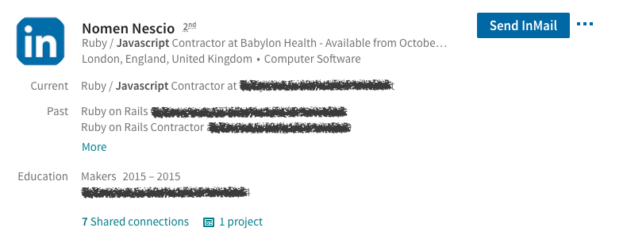

This Chrome extension has been built for use on the "Talent Pool" page of the search in LinkedIn's [Recruiter Lite](https://business.linkedin.com/talent-solutions/recruiter-lite) tool. It will replace the names and profile images of candidates with generic placeholders, as shown below, with the intention of removing implicit bias during the initial candidate sourcing process. 

I'm sharing this now because I think it could still help people and I may never get around to packaging it. It's also a good, simple example of `content_scripts` use in a Chrome extension.

### Disclaimers
- This extension has not been tested widely elsewhere, and though [limited to the LinkedIn domain](https://github.com/barneyjackson/linkedin_mask/blob/master/manifest.json#L10) it may have unexpected effects for which I take zero responsibility
- This extension has not (yet) been packaged, so you will need to download and "[Load unpacked](https://developer.chrome.com/extensions/getstarted#manifest)" yourself
